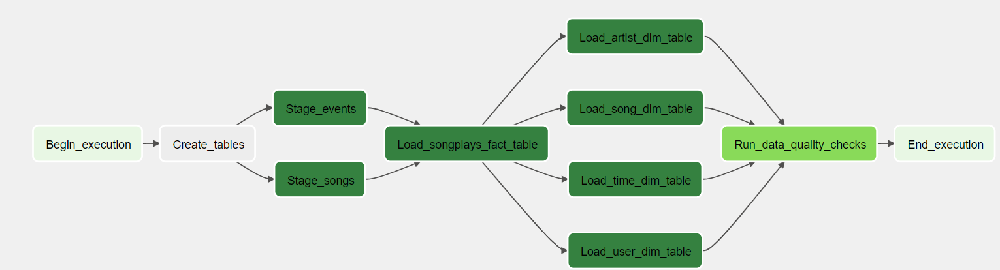

# Project: Data Pipelines with Airflow

In this project, we create data pipelines using Apache Airflow, for a fictional streaming company called Sparkify. 

The company's source data resides in **S3**, and must be processed in Sparkify's data warehouse in **Amazon Redshift**. The source datasets consist of JSON logs, that record user activity in Sparkify's application, and JSON metadata about the songs the users listen to.

## DAG structure
The structure of the DAG is as follows:

## The DAG stages

### create_tables_task
- Deletion of currently existing tables, if any
- Creation of the staging, fact and dimension tables

### stage_events_to_redshift
- Loading data to the staging_events table, from S3 to redshift, using the StageToRedshiftOperator()

### stage_songs_to_redshift
- Loading data to the staging_songs table, from S3 to redshift, using the StageToRedshiftOperator()

### load_songplays_table
- Loading data to our fact table (songplays) in redshift, using the LoadFactOperator()

### Loading the dimension tables:
Data is loaded into the following tables in redshift, using the LoadDimensionOperator():
- users
- songs
- artists
- time

### run_quality_checks
- This task checks the quality of the data in the fact and dimension tables, by checking that our tables are not empty